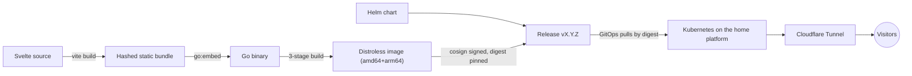

# naranjo.online

[](https://github.com/snaraj/naranjo.online/actions/workflows/pr-gate.yml)
[](https://github.com/snaraj/naranjo.online/actions/workflows/codeql.yml)
[](https://github.com/snaraj/naranjo.online/releases)
[](https://github.com/snaraj/naranjo.online/actions/workflows/pr-gate.yml)
[](https://github.com/snaraj/naranjo.online/actions/workflows/pr-gate.yml)
[](go.mod)
[](LICENSE)

Samuel's personal corner of the internet — portfolio, professional home, and
whatever deserves a permanent URL. A Svelte frontend embedded into a single
dependency-free Go binary, shipped as a distroless multi-arch container and a
Helm chart, deployed by digest onto a self-hosted Kubernetes platform behind
Cloudflare.

## How it works



The Go service serves the embedded bundle with strict caching, conditional
requests, security headers, and `/livez` + `/readyz` probes on port 8080.
There is no runtime dependency beyond the Go standard library.

## Development

```sh
# Frontend: build first — the Go embed test expects the bundle to exist.
cd frontend
npm ci --ignore-scripts
npm run check && npm test && npm run build

# Backend — the same gate CI enforces
cd ..
test -z "$(gofmt -l .)"
go vet ./...
CGO_ENABLED=0 go test ./...
go test -race ./...

# Container (both production architectures)
docker build .
```

Toolchain pins live in CI (`node 24.19.0`, `npm 11.17.0`, `go 1.26.5`);
newer local versions generally work, CI is authoritative.

## Releases

Every protected-main merge publishes exactly one patch release after the
merged SHA's PR gate succeeds. The merged source carries numeric `X.Y.Z` in
`VERSION`, chart `version`, `appVersion`, and the dated changelog heading, and
exact plain `vX.Y.Z` in the image tag. Automation creates that plain tag at the
exact SHA and explicitly dispatches the tag-bound publisher, which builds or
verifies:

- `ghcr.io/snaraj/naranjo-online:vX.Y.Z` — multi-arch image, keyless-signed
  (Cosign), with SBOM and SLSA provenance; deployment consumes the digest,
  never the tag.
- `ghcr.io/snaraj/charts/naranjo-online:X.Y.Z` — the Helm chart as an OCI
  artifact, also signed. This is the one narrow tag exception: Helm requires
  the registry tag to equal valid chart SemVer, and `vX.Y.Z` is not SemVerV2.
- A GitHub Release with the immutable digests and human notes.

Version tags are immutable and never reassigned. A retry reuses only exact,
complete, correctly signed source state; partial or conflicting immutable
state is reported as burned and requires a new patch. Release publication is
separate from deployment or promotion. See [CHANGELOG.md](CHANGELOG.md) for
history and [SECURITY.md](SECURITY.md) for the security posture.

An OCI reference such as `image:vX.Y.Z@sha256:<digest>` or
`chart:X.Y.Z@sha256:<digest>` contains a tag plus immutable digest; the complete
string is a reference, never a tag.

## Panels

`/api/panels` serves small, versioned, read-only display panels — token
usage, version-control activity, a boss log. Every response is the same
`panel/v1` envelope, prepared in memory at construction so a request is a map
lookup and one write, and every payload carries a `status` of `ok`, `stale`,
or `unavailable` that describes where the data actually came from. A panel
that cannot load its data still answers, with its identity intact and its
data `null`; it never fabricates numbers.

Panels have two data sources. The default everywhere is an **embedded
snapshot**: JSON captured out of band, compiled into the binary, validated
once at startup. The second is a **background live fetch**, which is opt-in,
disabled by default, and the only reason this process would ever make an
outbound request.

Two of the live producers need no credential at all — the game hiscores and
the version-control contribution calendar are public documents — so they are
gated by `PANELS_REFRESH` and an egress allowance alone. The token-usage
producers additionally need credentials, and a source whose credential is
absent is simply skipped.

Mounted panels re-read their envelope roughly once a minute and stop entirely
while the tab is hidden. Because each response carries a digest ETag, an
unchanged panel costs a conditional request and a bodyless `304`.

### Enabling live refresh (not enabled anywhere today)

Live refresh is off in every deployment this repository describes, and
turning it on is a reviewed operational change, not a code change. It
requires all of the following, together:

1. `PANELS_REFRESH=true` in the pod environment. Any other value than
   `true`/`false` fails the boot rather than guessing.
2. The credential environment variables named by the `keyEnvName` fields in
   `internal/panels/config/fetch.json`, supplied as cluster Secrets. They are
   read at fetch time only, flow straight into a request header, and are
   never stored, logged, or served. **No key, and no reference to a key,
   belongs in this repository** (requirement 12). A source whose variable is
   unset is simply skipped; it is never an error and never a fabricated
   number.
3. An egress allowance for the hosts in that file's `hosts` allowlist. The
   chart's NetworkPolicy is ingress-only today, so with policy unchanged the
   refresh attempts fail and the panels keep serving their snapshots as
   `stale` — the fail-soft outcome, not an outage.

**Cluster enablement is a separate owner-reviewed step** (standing audit item
S2) covering the Secret material, the egress policy, and the review of what
the origin is then permitted to talk to. Nothing in this repository performs
it, and no artifact here should be read as approval for it.

## Media

Small UI assets live under `frontend/src/assets/` in documented categories
with a per-file size ceiling. Heavy media (source video, FLAC, delivery
derivatives) never enters this repository, the bundle, the image, or the
cluster control plane — it is served from dedicated storage on the platform.

## License

Code is [MIT](LICENSE). Site content — text, images, video, audio, branding
— is **all rights reserved**; the license does not extend to it.
