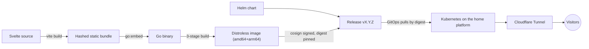

# naranjo.online

[](https://github.com/snaraj/naranjo.online/actions/workflows/pr-gate.yml)
[](https://github.com/snaraj/naranjo.online/actions/workflows/codeql.yml)
[](https://github.com/snaraj/naranjo.online/actions/workflows/browser-lanes.yml)
[](https://github.com/snaraj/naranjo.online/releases)
[](https://github.com/snaraj/naranjo.online/actions/workflows/pr-gate.yml)
[](https://github.com/snaraj/naranjo.online/actions/workflows/pr-gate.yml)
[](go.mod)
[](LICENSE)

Samuel's personal corner of the internet — portfolio, professional home, and
whatever deserves a permanent URL. A Svelte frontend embedded into a single
dependency-free Go binary, shipped as a distroless multi-arch container and a
Helm chart, deployed by digest onto a self-hosted Kubernetes platform behind
Cloudflare.

## How it works



The Go service serves the embedded bundle with strict caching, conditional
requests, security headers, and `/livez` + `/readyz` probes on port 8080.
There is no runtime dependency beyond the Go standard library.

Public traffic is HTTPS-only: TLS terminates at the Cloudflare edge, and the
tunnel carries it to this plain-HTTP origin, never reachable directly. The
edge declares that public leg's scheme in `X-Forwarded-Proto`, and a client
cannot forge that header — Cloudflare does not honor a client-supplied one —
so the origin's own `Strict-Transport-Security: max-age=31536000` (365 days,
no subdomains) is minted only on legs the edge itself declares TLS. Either
way, the header observed reaching a visitor is the edge's
`max-age=31536000; includeSubDomains`: the two lifetimes are now identical, so
`includeSubDomains` is the only difference between what the origin mints and
what a browser is told. That origin promise only matters if the edge is ever
bypassed. Non-preloaded HSTS protects every visit after the first, upgrading a
later link, typed hostname, or downgrade attempt before any packet leaves, but
not that first visit, which may still go out as plain HTTP exactly as
interceptable as before; the 301 answers that exposure, it does not fix it.
Only `preload` closes it, and only once the domain actually ships in browsers'
preload lists. At a year with `includeSubDomains` the edge response now clears
the list's eligibility bar on lifetime and scope; the `preload` directive is
absent and the domain is not submitted, so the gap stays open on a deliberate
submission decision, not on a lifetime this site was unwilling to serve.

`includeSubDomains` costs nothing for a first-level subdomain: the apex
certificate already carries `*.naranjo.online`, so `www`, `blog`, and similar
inherit valid TLS automatically. The real constraint is one level deeper:
Cloudflare's free wildcard covers exactly one label, so a host like
`api.staging.naranjo.online` gets no certificate without Advanced Certificate
Manager, a paid add-on; under `includeSubDomains` that would make it
unreachable, not merely insecure, at a cost this project doesn't spend.
Grey-clouded (DNS-only) records bypass the edge certificate entirely. Preload
would make that constraint effectively permanent — removal from the list
travels only as fast as browsers ship it — so submitting would bind every
subdomain this site ever adds to the same paid-certificate trap, which is
exactly why the step still outstanding is a decision and not a formality.

## Development

```sh
# Frontend: build first — the Go embed test expects the bundle to exist.
cd frontend
npm ci --ignore-scripts
npm run check && npm test && npm run build

# Backend — the same gate CI enforces
cd ..
test -z "$(gofmt -l .)"
go vet ./...
CGO_ENABLED=0 go test ./...
go test -race ./...

# Container (both production architectures)
docker build .
```

Toolchain pins live in CI (`node 24.19.0`, `npm 11.17.0`, `go 1.26.6`);
newer local versions generally work, CI is authoritative.

The rendering-lane smoke matrix is separate, because it needs real browser
engines rather than only Node. It boots the built Go binary over localhost and
drives Chromium, Firefox and WebKit at desktop, Android and iPhone viewports:

```sh
cd frontend
npm run build                                     # the binary embeds this
npx playwright install chromium firefox webkit    # once per runner version
npm run test:browsers
```

## Releases

Every protected-main merge that changes an artifact publishes exactly one patch
release after the merged SHA's PR gate succeeds. A merge whose every commit is
confined to the documentation allowlist — root `AGENTS.md`, `README.md`,
`.gitignore`, and Markdown under `docs/` — changes no artifact, so it advances
no version and publishes nothing; the orchestrator proves that class against
evidence the merge cannot choose, then logs an explicit verdict instead of
dispatching the publisher. That evidence is threefold: the last successful
protected-`main` gate head from the Actions record, with every release lock
required byte-identical to it; an anchor-advance walk that begins at the
recovered release boundary and steps over that same already released push's
artifact commits, hard-capped at that gated head so a lock-free artifact commit
landing after it cannot be stepped over; and a re-classification as
documentation of the gap the walk leaves behind — from the advanced anchor to
the merged head, not from the boundary, since the prefix the walk consumed is
genuine artifact history that already released. Nothing
is relaxed by that: an unchanged artifact has nothing to version, sign, scan,
or attest, and documentation merges still run the entire PR gate. The merged
source of an artifact release carries numeric `X.Y.Z` in
`VERSION`, chart `version`, `appVersion`, and the dated changelog heading, and
exact plain `vX.Y.Z` in the image tag. Automation creates that plain tag at the
exact SHA and explicitly dispatches the publisher definition from protected
`main` with the authoritative successful-run ID. A separate read-only job
validates that exact PR-gate push run before the write/packages/OIDC job can
start; a manual dispatch for an unmerged branch fails before publication.
Both enabled merge modes are covered: a squash is one linear commit, while a rebase may
install several commits in one push; either produces one release for the exact
final source tree. The publisher builds or verifies:

- `ghcr.io/snaraj/naranjo-online:vX.Y.Z` — multi-arch image, keyless-signed
  (Cosign), with SBOM and SLSA provenance; deployment consumes the digest,
  never the tag.
- `ghcr.io/snaraj/charts/naranjo-online:X.Y.Z` — the Helm chart as an OCI
  artifact, also signed. This is the one narrow tag exception: Helm requires
  the registry tag to equal valid chart SemVer, and `vX.Y.Z` is not SemVerV2.
  It is packaged with that release's resolved image digest already in
  `image.digest`, so it is deployable as published; the committed
  `chart/values.yaml` keeps an all-zeros fail-closed sentinel no registry can
  resolve, and only the published artifact carries the real digest.
- A GitHub Release with the immutable digests, human notes, and exactly one
  canonical JSON evidence manifest binding the source SHA, successful-main run,
  image/chart digests and aliases, signer identity, platforms, provenance, and
  vulnerability-scan policy/results.

This automatic path may not leave Draft until the repository owner's read-only
receipt proves that GitHub immutable releases are enabled and `main` requires
the exact GitHub Actions checks against the current base, and the owner's
separate read-only bypass check reports no bypass actor.
The publisher first validates the exact successful PR-gate job inventory and
the separate exact-SHA successful CodeQL `main` run and job inventory. It scans
source dependencies, including frontend development dependencies, and the final
image digest with the checksum-pinned Trivy binary, rejecting every fixed or
unfixed high/critical finding. Immediately before building the manifest it
re-resolves both public aliases to the exact produced image/chart digests and
validates the strict raw SBOM schema, platform, and subject digest for both
platforms. It uploads the manifest to a draft Release, verifies the closed
one-asset REST inventory and downloaded bytes, and only then publishes. An
exact zero-asset draft may resume a response-lost upload without clobber; every
other partial/foreign state fails closed. Every
created or reused Release must report exact immutable metadata and that exact
manifest. Its terminal check re-fetches the immutable Release, downloads and
compares the manifest again, then re-fetches the live tag ref and annotated
object and binds the server-locked tag back to the exact signed source. No
mutation follows. A weekly read-only audit repeats the Release/manifest/run/tag,
semantic-alias/digest, signature, SLSA/SBOM, chart-source, and vulnerability
bindings as later detection; it never substitutes for the pre-manifest alias
and SBOM proof. Version tags are locked by the GitHub control and never reassigned. A
retry reuses only exact, complete,
correctly signed source state; partial or conflicting state is reported as
burned and requires a new patch. Release publication is separate from
deployment or promotion. See [the release governance runbook](docs/release-governance.md),
[CHANGELOG.md](CHANGELOG.md), and [SECURITY.md](SECURITY.md).

An OCI reference such as `image:vX.Y.Z@sha256:<digest>` or
`chart:X.Y.Z@sha256:<digest>` contains a tag plus immutable digest; the complete
string is a reference, never a tag.

## Panels

`/api/panels` serves small, versioned, read-only display panels — token
usage, version-control activity, a boss log. Every response is the same
`panel/v1` envelope, prepared in memory at construction so a request is a map
lookup and one write, and every payload carries a `status` of `ok`, `stale`,
or `unavailable` that describes where the data actually came from. A panel
that cannot load its data still answers, with its identity intact and its
data `null`; it never fabricates numbers.

Panels have two data sources. The default everywhere is an **embedded
snapshot**: JSON captured out of band, compiled into the binary, validated
once at startup. The second is a **background live fetch**, which is opt-in,
disabled by default, and the only reason this process would ever make an
outbound request.

Most of the live producers need no credential at all — the game hiscores, the
version-control contribution calendar, and the public per-repository commit
lists are public documents — so they are gated by `PANELS_REFRESH` and an
egress allowance alone. Their configuration has no field a credential could be
written into, and the one general escape hatch left, the static request-header
map, admits exactly one header name. The token-usage producers additionally
need credentials, and a source whose credential is absent is simply skipped.

Mounted panels re-read their envelope roughly once a minute and stop entirely
while the tab is hidden, and each panel's header carries a refresh control
that forces one immediate re-read through the same single-flight path. Because
each response carries a digest ETag, an unchanged panel costs a conditional
request and a bodyless `304`.

Upstream is a different clock, and deliberately a slower one. The refresh loop
wakes on the shared cadence (`ttlMinutes`), but each producer additionally
carries its OWN rate budget — `minIntervalMinutes` in
`internal/panels/config/fetch.json` — and a wake that finds every endpoint
still inside its budget contacts nothing at all. The budget is spent per
ATTEMPT rather than per success, so a failing upstream is retried no faster
than a healthy one is polled. The shipped figures are a quarter hour for the
contribution calendar and the game hiscores, and ten minutes for the commit
lists; a test computes the worst-case hourly request count per host from that
configuration and fails if it passes half the documented budget for that host.

Every outbound answer is bounded before it is believed: an exact declared
media type, a per-endpoint byte cap, a per-attempt timeout, a 200-only status
gate with rate-limit refusals backed off further than the ordinary cadence,
and refused redirects. The destination is bounded too — the host allowlist
governs a NAME, so the transport additionally refuses to connect unless every
address that name resolves to is public, and then dials the exact addresses it
admitted. A private, loopback, link-local, carrier-grade, or reserved answer
for an allowlisted host is refused rather than followed.

When a producer fails, the panel keeps its last good data and says so. The
version-control panel reports both halves separately: the envelope's
`generatedAt` is the calendar's own fetch instant, `commitsAt` is the commit
list's, and the envelope is `ok` only when both halves are live. A commit list
that has never been fetched serves as an empty array with no `commitsAt` at
all, so "nobody managed to look" can never render as "there are no recent
commits".

### Enabling live refresh (not enabled anywhere today)

Live refresh is off in every deployment this repository describes, and
turning it on is a reviewed operational change, not a code change. It
requires all of the following, together:

1. `PANELS_REFRESH=true` in the pod environment. The chart renders that
   variable from `panels.refresh.enabled`, which defaults to `false` and is
   required by `chart/values.schema.json` — a values file that omits the
   decision fails validation rather than letting the origin guess, and the
   variable is rendered whether it is on or off so the deployed state is
   readable off the manifest. Any value other than `true`/`false` fails the
   boot rather than guessing.
2. The credential environment variables named by the `keyEnvName` fields in
   `internal/panels/config/fetch.json`, supplied as cluster Secrets. They are
   read at fetch time only, flow straight into a request header, and are
   never stored, logged, or served. **No key, and no reference to a key,
   belongs in this repository** (requirement 12). A source whose variable is
   unset is simply skipped; it is never an error and never a fabricated
   number. This applies to the token-usage producers ONLY — the game
   hiscores, the contribution calendar, and the commit lists are zero-secret
   by construction and need nothing from this step.
3. An egress allowance for the hosts in that file's `hosts` allowlist. The
   chart's NetworkPolicy denies every outbound connection — it declares the
   `Egress` policy type over an empty rule list — so with policy unchanged
   the refresh attempts fail and the panels keep serving their snapshots as
   `stale` — the fail-soft outcome, not an outage. Turning that into an
   allowance means naming exact destinations in a separately reviewed change
   (issue #79); it never means removing the deny. Until that lands, setting
   `panels.refresh.enabled` buys nothing but failed attempts.

**Cluster enablement is a separate owner-reviewed step** (standing audit item
S2) covering the Secret material, the egress policy, and the review of what
the origin is then permitted to talk to. Nothing in this repository performs
it, and no artifact here should be read as approval for it.

## Media

Small UI assets live under `frontend/src/assets/` in documented categories
with a per-file size ceiling. Heavy media (source video, FLAC, delivery
derivatives) never enters this repository, the bundle, the image, or the
cluster control plane — it is served from dedicated storage on the platform.

## License

Code is [MIT](LICENSE). Site content — text, images, video, audio, branding
— is **all rights reserved**; the license does not extend to it.
