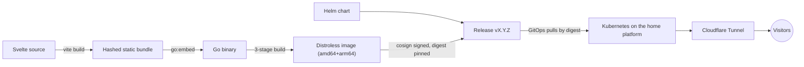

# naranjo.online

[](https://github.com/snaraj/naranjo.online/actions/workflows/pr-gate.yml)
[](https://github.com/snaraj/naranjo.online/actions/workflows/codeql.yml)
[](https://github.com/snaraj/naranjo.online/releases)
[](https://github.com/snaraj/naranjo.online/actions/workflows/pr-gate.yml)
[](https://github.com/snaraj/naranjo.online/actions/workflows/pr-gate.yml)
[](go.mod)
[](LICENSE)

Samuel's personal corner of the internet — portfolio, professional home, and
whatever deserves a permanent URL. A Svelte frontend embedded into a single
dependency-free Go binary, shipped as a distroless multi-arch container and a
Helm chart, deployed by digest onto a self-hosted Kubernetes platform behind
Cloudflare.

## How it works



The Go service serves the embedded bundle with strict caching, conditional
requests, security headers, and `/livez` + `/readyz` probes on port 8080.
There is no runtime dependency beyond the Go standard library.

Public traffic is HTTPS-only: TLS terminates at the Cloudflare edge, and the
tunnel carries it to this plain-HTTP origin, never reachable directly. The
edge declares that public leg's scheme in `X-Forwarded-Proto`, and a client
cannot forge that header — Cloudflare does not honor a client-supplied one —
so the origin's own `Strict-Transport-Security: max-age=31536000` (365 days,
no subdomains) is minted only on legs the edge itself declares TLS. Either
way, the header observed reaching a visitor is the edge's
`max-age=31536000; includeSubDomains`: the two lifetimes are now identical, so
`includeSubDomains` is the only difference between what the origin mints and
what a browser is told. That origin promise only matters if the edge is ever
bypassed. Non-preloaded HSTS protects every visit after the first, upgrading a
later link, typed hostname, or downgrade attempt before any packet leaves, but
not that first visit, which may still go out as plain HTTP exactly as
interceptable as before; the 301 answers that exposure, it does not fix it.
Only `preload` closes it, and only once the domain actually ships in browsers'
preload lists. At a year with `includeSubDomains` the edge response now clears
the list's eligibility bar on lifetime and scope; the `preload` directive is
absent and the domain is not submitted, so the gap stays open on a deliberate
submission decision, not on a lifetime this site was unwilling to serve.

`includeSubDomains` costs nothing for a first-level subdomain: the apex
certificate already carries `*.naranjo.online`, so `www`, `blog`, and similar
inherit valid TLS automatically. The real constraint is one level deeper:
Cloudflare's free wildcard covers exactly one label, so a host like
`api.staging.naranjo.online` gets no certificate without Advanced Certificate
Manager, a paid add-on; under `includeSubDomains` that would make it
unreachable, not merely insecure, at a cost this project doesn't spend.
Grey-clouded (DNS-only) records bypass the edge certificate entirely. Preload
would make that constraint effectively permanent — removal from the list
travels only as fast as browsers ship it — so submitting would bind every
subdomain this site ever adds to the same paid-certificate trap, which is
exactly why the step still outstanding is a decision and not a formality.

## Local development

```sh
make run                 # build once, then serve the full app at http://localhost:8080
PORT=9090 make run       # override the port
make dev                  # Vite HMR at http://127.0.0.1:5173, proxying /api to a locally
                           # built backend on the same PORT (default 8080)
make help                  # list every target
```

`make dev` builds the backend to a real binary and launches it in the
background under a captured PID, killed by a trap on `EXIT`/`INT`/`TERM` —
never a backgrounded `go run`, whose child process survives the parent's
death and orphans the listening port. Both `run` and `dev` set
`LISTEN_ADDRESS=127.0.0.1` for the backend they launch (Vite's own HMR
server already binds `127.0.0.1` unconditionally), so neither target ever
listens on a non-loopback interface — verify with `lsof -iTCP -sTCP:LISTEN
-n -P` or equivalent. `LISTEN_ADDRESS` is unset by default and the deployed
Helm chart never sets it, so production's all-interfaces bind — required
inside the pod network — is unchanged; the override exists only for this
local loop. `PORT` must be a decimal integer between 1 and 65535; any other
value is refused before any process starts. **Set `PORT` as an environment
variable (`PORT=9090 make run`), never as a `make` command-line argument
(`make run PORT=9090`)** — GNU Make reconstructs its own MAKEOVERRIDES/MFLAGS
from every command-line `VAR=value` argument, for every target, which fully
expands the value (including a `$(shell ...)` call) before any recipe runs;
no Makefile-side code can intercept that. The environment-variable form is
not subject to it and is the only form this repository documents or
supports.

Locally the app serves egress-free and media-free, and that is a property of
the unset environment rather than a build flag: live refresh (`PANELS_REFRESH`)
starts no loop unless it is switched on, and media stays disabled unless
`MEDIA_ENABLED`, `MEDIA_ROOT`, and `MEDIA_MAX_CONCURRENT` are all supplied
together. What the deployed chart supplies is a separate question, answered in
"Enabling live refresh" and "Media" below; the local default path is unchanged
either way.

## Development

The full local gate — frontend, backend, chart, container, and both secret
scans — is canonical in `AGENTS.md` ("Quality gates — exact commands and
patterns"); run it exactly as written there before every push. Toolchain
pins live in CI (`node 24.19.0`, `npm 11.17.0`, `go 1.26.6`); newer local
versions generally work, CI is authoritative.

The rendering-lane smoke matrix (also in that AGENTS.md section) is
separate because it needs real browser engines rather than only Node: it
boots the built Go binary over localhost and drives Chromium, Firefox and
WebKit at desktop, Android and iPhone viewports. In CI it runs on pull
requests and manual dispatch — never on the merge, which would re-measure
the identical tree — so it carries no `main` status badge.

## Releases

Every protected-main merge that changes an artifact publishes exactly one
patch release after the merged SHA's PR gate succeeds. A merge whose every
commit is confined to the documentation allowlist — root `AGENTS.md`,
`README.md`, `.gitignore`, and Markdown under `docs/` — changes no artifact,
advances no version, and publishes nothing; the orchestrator proves that
class against evidence the merge cannot choose, then logs an explicit
verdict instead of dispatching the publisher. The complete classification,
its two deliberate denial modes, and their recovery paths are canonical in
`AGENTS.md` requirement 10 and
[the release governance runbook](docs/release-governance.md) — this section
is a summary, not a second copy.

A read-only authorization job validates the exact successful PR-gate job
inventory and the separate exact-SHA successful CodeQL `main` run before any
privileged step. The publisher scans source dependencies, explicitly
including frontend development dependencies, and the final image digest
with the checksum-pinned Trivy binary, rejecting every fixed or unfixed
high/critical finding. It builds or verifies:

- `ghcr.io/snaraj/naranjo-online:vX.Y.Z` — multi-arch image, keyless-signed
  (Cosign), with SBOM and SLSA provenance; deployment consumes the digest,
  never the tag.
- `ghcr.io/snaraj/charts/naranjo-online:X.Y.Z` — the signed Helm chart as an
  OCI artifact (numeric because Helm requires chart-SemVer registry tags),
  packaged with that release's resolved image digest already embedded; the
  committed `chart/values.yaml` keeps an all-zeros fail-closed sentinel no
  registry can resolve.
- A GitHub Release with the immutable digests, human notes, and exactly one
  canonical JSON evidence manifest binding the source SHA, successful-main
  run, image/chart digests and aliases, signer identity, platforms,
  provenance, and vulnerability-scan policy/results.

Immediately before sealing that manifest the publisher re-resolves both
public aliases to the exact produced digests and validates the
strict raw SBOM schema, platform, and subject digest for both platforms;
a weekly read-only audit repeats those bindings as later detection and
never substitutes for the pre-manifest alias and SBOM proof. This automatic path
may not leave Draft until the repository owner's read-only receipt proves
immutable releases and exact required checks, and the owner's separate
read-only bypass check reports no bypass actor. Version tags are locked by
the GitHub control and never reassigned; release publication is separate
from deployment or promotion. An OCI reference such as
`image:vX.Y.Z@sha256:<digest>` contains a tag plus immutable digest — the
complete string is a reference, never a tag. See
[CHANGELOG.md](CHANGELOG.md) and [SECURITY.md](SECURITY.md).

## Panels

`/api/panels` serves small, versioned, read-only display panels — token
usage, version-control activity, a boss log. Every response is the same
`panel/v1` envelope, prepared in memory at construction so a request is a map
lookup and one write, and every payload carries a `status` of `ok`, `stale`,
or `unavailable` that describes where the data actually came from. A panel
that cannot load its data still answers, with its identity intact and its
data `null`; it never fabricates numbers.

Panels have two data sources. The default everywhere is an **embedded
snapshot**: JSON captured out of band, compiled into the binary, validated
once at startup. The second is a **background live fetch**, which is opt-in,
disabled by default, and the only reason this process would ever make an
outbound request.

Most of the live producers need no credential at all — the game hiscores, the
version-control contribution calendar, and the public per-repository commit
lists are public documents — so they are gated by `PANELS_REFRESH` and an
egress allowance alone. Their configuration has no field a credential could be
written into, and the one general escape hatch left, the static request-header
map, admits exactly one header name. The token-usage producers additionally
need credentials, and a source whose credential is absent is simply skipped.

Mounted panels re-read their envelope roughly once a minute and stop entirely
while the tab is hidden. Because each response carries a digest ETag, an
unchanged panel costs a conditional request and a bodyless `304`.

Upstream is a different clock, and deliberately a slower one. The refresh loop
wakes on the shared cadence (`ttlMinutes`), but each producer additionally
carries its OWN rate budget — `minIntervalMinutes` in
`internal/panels/config/fetch.json` — and a wake that finds every endpoint
still inside its budget contacts nothing at all. The budget is spent per
ATTEMPT rather than per success, so a failing upstream is retried no faster
than a healthy one is polled. The shipped figures are a quarter hour for the
contribution calendar and the game hiscores, and ten minutes for the commit
lists; a test computes the worst-case hourly request count per host from that
configuration and fails if it passes half the documented budget for that host.

Every outbound answer is bounded before it is believed: an exact declared
media type, a per-endpoint byte cap, a per-attempt timeout, a 200-only status
gate with rate-limit refusals backed off further than the ordinary cadence,
and refused redirects. The destination is bounded too — the host allowlist
governs a NAME, so the transport additionally refuses to connect unless every
address that name resolves to is public, and then dials the exact addresses it
admitted. A private, loopback, link-local, carrier-grade, or reserved answer
for an allowlisted host is refused rather than followed.

When a producer fails, the panel keeps its last good data and says so. The
version-control panel reports both halves separately: the envelope's
`generatedAt` is the calendar's own fetch instant, `commitsAt` is the commit
list's, and the envelope is `ok` only when both halves are live. The two halves
are captured on their own schedules and the payload says which is which, so a
commit list read after the calendar it sits under is described rather than
hidden.

### Refreshing the shipped snapshots

The embedded snapshots are what a deployment serves whenever live refresh is
off, what every panel falls back to when a fetch fails, and what the site
serves locally, so keeping them true is an operator task rather than a code
one. Both steps below are read-only, run on the operator's own machine, and
put only public or aggregate facts into the repository.

**The daily token series.** `scripts/capture_usage_series.py` walks a local
agent transcript tree — one JSON object per line, beside an ISO 8601
timestamp — and reduces it to one combined token total per UTC calendar day,
the same quantity the live mapper sums out of the vendor usage API. Standard
library only, no network:

    scripts/capture_usage_series.py --transcripts <dir> --source <label>
    scripts/capture_usage_series.py --transcripts <dir> --source <label> \
        --format running-totals
    scripts/capture_usage_series.py --transcripts <dir> --source <label> \
        --snapshot internal/panels/snapshots/token-usage.json

`--format` names the RECORD SHAPE the tree is journalled in, because the tools
write the same arithmetic two different ways. `messages` (the default) is one
billed message per line carrying its own usage; the same message is replayed
into later files when a session resumes or forks, so it is de-duplicated on
its message and request identifiers. `running-totals` is a cumulative figure
for the session so far, repeated on every event; summing those multiplies the
truth, so the contribution of one record is how far the running total ADVANCED
since the record before it, attributed to its own UTC day. A repeat advances
nothing; a session that restarts its accounting mid-file contributes its new
total, which is that turn's own usage. Both shapes then share one day index,
one set of streak arithmetic, and one emission guard.

Without `--snapshot` it prints the series and its derived figures so a capture
can be read before it is committed to anything. With it, the series is spliced
into that source and the three tiles a daily series DEFINES — the peak day and
both streaks, the same keys the live mapper computes — are recomputed from it,
so the tiles and the graph under them cannot disagree. No other tile is
touched: a lifetime total or a session count is a figure this step cannot
measure, and overwriting one it cannot measure would be an invention.

Requirement 12 is the whole design of that step. Transcripts contain prompts,
responses, file names, project directories and session identifiers; the only
values the program can emit are calendar dates and non-negative integers, a
guard re-proves that immediately before anything is written, and diagnostics
are counts rather than names — a file it cannot read is tallied, never
identified. `scripts/ci/test_capture_usage_series.py` asserts that directly,
by walking a fixture tree seeded with paths and identifiers — one per record
shape — and proving none of them survive into the emission. The same suite
pins the module's import surface to a closed allowlist held against a refused
set, so widening the reviewed surface is a conscious edit naming the module
that got in; adding one turns the suite red before it can turn into a commit.

That pin is a review bound, not a capability proof, and the difference is
load-bearing: an allowed import can re-export a refused one, so no allowlist
of import names can establish that a program cannot spawn. When the runtime
producer runs, it runs inside a kernel sandbox that denies process creation
and network access outright (`scripts/usage-export/producer.sb`, applied by
the scheduled push and refused-if-absent), and that is the enforced
capability: **no fork, no network**. State it that narrowly, because that
profile is `(allow default)` with two denials — exec IN PLACE and filesystem
access remain, as the profile itself says in full. Neither buys anything for
an attacker here (the sandbox is inherited across an in-place exec, and the
walk is over records the producer must read anyway), but they are the
difference between the enforced boundary and a wider claim, and the wider
claim is not made.

**The recent commit list.** The rows are public commits from the repositories
`internal/panels/config/fetch.json` already names as commit sources, read the
way the live producer reads them and written newest first, with `commitsAt`
recording the instant they were read. Nothing beyond the public repository
name, the subject line, and the commit instant is captured. A shipped row
naming a repository no configured source produces would be a row no refresh
could ever replace, and the panel's own suite refuses one.

The contribution calendar half keeps its own capture instant and its own
fixture (`internal/panels/testdata/contributions-fragment.html`); a suite pin
cross-checks the shipped calendar against that fixture, so refreshing the
calendar means refreshing both together.

### Sealed runtime data (the panels data root)

Between shipped snapshots and live refresh sits a third path with neither's
costs: the workstation exports the local usage records as a sanitized
`usage-series/v1` document (`scripts/export_usage_series.py` — the same
dates-and-integers guard as the capture step, plus per-day category
breakdowns that must partition each day's total), seals it with AES-256-GCM
(`cmd/usageseal`), and pushes the ciphertext over an ssh session that reads
no configuration file at all — `-F /dev/null`, every option stated
explicitly, and the resolved configuration checked with `ssh -G` before a
connection is opened — to a node path the chart projects into the pod as a
read-only `local` PersistentVolume/PersistentVolumeClaim pair on the
platform's enumerated StorageClass. The origin re-reads that file every five minutes, unseals it with
`PANELS_DATA_KEY` (read at decrypt time only, from a Secret the chart
references but never contains), strict-decodes it under the pipeline's single
128 KiB sealed-payload ceiling and a monotonic replay floor, and serves the
result — so the token-usage panel
refreshes without a release and without any egress from the cluster.

Fail-closed at every absence: no `PANELS_DATA_ROOT`, no key, no file, or a
file that is tampered, replayed, oversized, or malformed all leave the last
good payload serving, with the envelope `status` saying so. The replay
floor persists across restarts as a sealed marker in a separate writable
state volume, so a restarted pod refuses ciphertext older than what any
previous process published — and that marker is written BEFORE the payload
is published, so a floor that cannot be persisted refuses the push instead
of serving ahead of it. An initialization tombstone sits beside the marker,
so a marker that has been DELETED is distinguishable from a first boot and
refuses rather than cold-starting on a lowered floor; declaring a cold start
is an explicit operator ceremony that says in the manual what protection it
gives up. The floor has one writer, enforced by the locked monotonic
compare-and-swap in the origin and by a render that refuses more than one
replica while the capability is on — not by the access mode: the state claim
is `ReadWriteOnce`, and the mode that would enforce it in the storage layer,
`ReadWriteOncePod`, is supported for CSI volumes only and this target runs
none. The capability defaults ON in the chart
(`panels.data.enabled=true`) since 2026-08-27. It defaulted off for as long as
the storage ceremony was outstanding, because claims rendered against absent
volumes leave a fresh install's pod Pending; both PersistentVolumes are now
applied and Available with claimRefs pre-pinned to these claim names, so the
claims bind rather than wait. Setting `panels.data.enabled=false` remains
fully supported and serves the embedded release-time snapshot — an explicit,
documented as-of-release state, still rendered and still checked on every pull
request. The end-to-end operator
manual — key generation, the forced-command push identity, the
cluster-side directory and PV ceremonies, enablement order, verification,
and the deliberate failure modes — is `docs/usage-export.md`; the chart
contract is pinned by `scripts/ci/chart-storage-pin.sh` in the same CI job
as the ingress and egress pins.

### Enabling live refresh (on since 2026-08-27)

Live refresh was off in every deployment this repository described until the
owner's live-sync directive of 2026-08-27. Turning it on was a reviewed
operational change, not a code change, and it required all of the following
together — which is also the list to re-read before changing any of them:

1. `PANELS_REFRESH=true` in the pod environment. The chart renders that
   variable from `panels.refresh.enabled`, which now defaults to `true` and is
   required by `chart/values.schema.json` — a values file that omits the
   decision fails validation rather than letting the origin guess, and the
   variable is rendered whether it is on or off so the deployed state is
   readable off the manifest. Any value other than `true`/`false` fails the
   boot rather than guessing. Setting it back to `false` remains supported and
   starts no loop at all.
2. The credential environment variables named by the `keyEnvName` fields in
   `internal/panels/config/fetch.json`, supplied as cluster Secrets. They are
   read at fetch time only, flow straight into a request header, and are
   never stored, logged, or served. **No key, and no reference to a key,
   belongs in this repository** (requirement 12). A source whose variable is
   unset is simply skipped; it is never an error and never a fabricated
   number. This applies to the token-usage producers ONLY — the game
   hiscores, the contribution calendar, and the commit lists are zero-secret
   by construction and need nothing from this step.
3. An egress allowance for the hosts in that file's `hosts` allowlist. This is
   the one the chart itself used to withhold: its NetworkPolicy denied every
   outbound connection, so refresh alone bought nothing but failed attempts and
   the same `stale` snapshots — fail-soft, not an outage. The policy now
   renders an allowance instead, and it is exactly two rules: TCP/443 to any
   address, and UDP+TCP/53 to the cluster DNS Pods, selected by namespace AND
   pod labels so the two are ANDed rather than ORed.

   **That is not the host bound, and the distinction matters.** A NetworkPolicy
   selects Pods, namespaces and CIDRs; it cannot express a host name at all, so
   rule 1 bounds the protocol and port and leaves the destination open. Writing
   a CIDR list there would look like a host bound while pinning addresses this
   repository cannot verify and upstreams re-assign at will. The host bound
   lives in `internal/panels/fetch.go`, where it can be exact: only absolute
   `https` URLs on the `fetch.json` allowlist are admitted, checked once at
   construction over every configured endpoint — so a config naming an unlisted
   host refuses to build — and checked again on every request after the URL has
   been rebuilt, so a redirect or a rewritten parameter cannot reach a host
   construction approved for nobody. Non-https schemes and URL userinfo are
   refused, and a resolved address in private, loopback or link-local space is
   refused at dial time, so an allowlisted NAME pointed at a LAN address by a
   hostile DNS answer still cannot be reached. Two layers, two different jobs.

   `chart/templates/network-policy.yaml` carries the same explanation beside
   the rules, and `scripts/ci/chart-egress-pin.sh` pins both rules as whole
   sub-trees — refusing a third rule, a widened or removed port, a loosened DNS
   peer, a list emptied back to allow-all, a list narrowed back to the retired
   deny, and a second policy document — across 29 text and 61 whole-render
   mutations.

One panel is claimed rather than refreshed when both capabilities are on.
With `PANELS_DATA_ROOT` set, the sealed data root OWNS the token-usage panel:
the live path starts no loop for it and never reaches its credentialed
endpoints, so the credential-free sealed feed is the only producer writing
it, and the pod logs that decision once at startup. Every OTHER
refresh-backed panel is unaffected — enabling the sealed feed never silently
disables the rest (2026-08-24 security review, finding 8).

**Cluster enablement was a separate owner-reviewed step** (standing audit item
S2) covering the Secret material, the egress policy, and the review of what the
origin is then permitted to talk to. The owner took it on 2026-08-27, and the
chart records the outcome: the refresh switch and the two-rule allowance ship
together, with the host bound where a policy cannot express it. Nothing in this
repository grants that step — the values and the policy describe a decision
already made, and changing either is another decision, not a formality.

## Observability contract

The origin emits OpenTelemetry-conformant structured logs to stdout with
the standard library only — one complete JSON object per line via
`log/slog`, attribute names following OTel semantic conventions — so an
OTel Collector can later ingest pod stdout with ZERO application change.
When stdout is not a terminal (every container) the format is JSON
automatically; on an interactive terminal it is human-readable text. Two
environment variables tune it, and an unrecognized value fails closed to
the default and emits one WARN naming the rejected value (logging is
operator convenience, not security behavior, so a typo never crash-loops
a pod):

- `LOG_FORMAT` — `json` | `text` (default: JSON off-terminal, text on one).
- `LOG_LEVEL` — `debug` | `info` | `warn` | `error` (default `info`).

**OTel Logs Data Model mapping.** slog `time` → Timestamp, `level` →
SeverityText (`DEBUG`/`INFO`/`WARN`/`ERROR`), `msg` → Body, `trace_id` →
TraceId; every other key is an attribute. Records carry NO SpanId: the
data model's SpanId names the span a record was produced in, and this
origin produces no spans — the inbound parent-id is the CALLER's span
(W3C trace-context §parent-id) and is therefore exposed only as the
custom `parent_span_id` attribute, never as a field a collector would
read as this record's own span. A real SpanId appears only when a real
local span exists (phase 3 below). Resource identity rides on every
record under its semantic-convention names — `service.name`
(`naranjo.online`), plus `service.version` and `vcs.ref.head.revision`
when the build embeds them (never invented — a build without VCS
stamping omits them; `build_time` is a custom attribute, as no stable
convention names a build timestamp).

Each request produces exactly one `request served` record —
`http.request.method`, `url.path`, `http.response.status_code`,
`http.response.body.size`, `network.protocol.version` (all semantic
conventions), plus the custom `request_id` and `duration_ms` — at INFO
for 2xx/3xx, WARN for 4xx, ERROR for 5xx (a handler panic logs `request
failed` with the error, then re-raises). `user_agent.original` rides only
at `debug`. Lifecycle: one startup line (`addr`, `port`, `log_format`,
`log_level`, `media_enabled`, `panels_refresh`), then `shutdown signal
received`, `server drained`, and a final `server exited` /
`server stopped`. Background panel refreshes log per-cycle outcomes at
INFO, failures at WARN with the error chain and next retry time, and
per-attempt `server.address`/`http.response.status_code`/
`http.response.body.size` detail at DEBUG.

**W3C trace context, hand-rolled and spec-exact.** A valid version-00
`traceparent` (lowercase hex, exact field lengths, version not `ff`,
non-zero trace and parent ids) is accepted and never mutated; its
trace-id lands on every record for that request as `trace_id` and its
parent-id as `parent_span_id` — which is exactly what a service mesh
needs from the app: sidecars emit the spans, the origin propagates and
correlates without claiming a span of its own. The origin deliberately
does NOT mint a `traceparent` when none arrives: it creates no spans, so
a self-minted trace id would fabricate a trace no participant recorded
(the honest-states doctrine applied to telemetry); `request_id` already
correlates traceless requests. An inbound `X-Request-Id` is honored only
when it matches `^[A-Za-z0-9_-]{1,64}$`; anything else is replaced by 16
random bytes as hex, and the response always carries `X-Request-Id`.

**Roadmap.** Today: OTel-conformant logs plus W3C propagation, stdlib
only. Phase 2: an OTel Collector on the cluster ingests this stdout
stream — no application change. Phase 3 (owner decision, requirement 9):
the in-process OTel SDK for internal span detail, adopted at
configuration level. Browser-side telemetry is a separate future lane
with its own privacy design.

**Privacy floor, pinned by tests.** Records carry the URL path only —
never a query string, which can carry secrets. No client IP is logged at
any level. Panel-refresh records name bare hosts and configuration labels
— never a URL, credential, or payload byte — and the media root path is
never logged.

## Media

Small UI assets live under `frontend/src/assets/` in documented categories
with a per-file size ceiling. Heavy media (source video, FLAC, delivery
derivatives) stays out of this repository, the bundle, the image, and the
cluster control plane — it is served from dedicated storage on the platform.
The one dated exception is the vendored gallery placeholder set under
`frontend/src/assets/images/gallery/` (issue #176): a narrow requirement-11
carve-out with provenance recorded in its `SOURCES.md`, an exact-file
allowlist plus size ceiling pinned by test, and replacement by the real
media pipeline tracked in issue #182.

Media is **enabled** as of 2026-08-27. It was an operator decision needing
ADR 0012's storage evidence and a provisioned claim, and both landed: the
claim is Bound against a `local` PersistentVolume on the platform's own
StorageClass and populated with the real tree, and the delivery contract was
proven against the running binary rather than a render. What issue #207 had
prepared was everything on this side of that decision — `media.enabled: true`
is representable only together with a reviewed profile, a named claim, a mount
path and a measured transfer budget, all four, and the mount it renders is
read-only. That conditional is unchanged; only the answer is. The shipped
defaults now satisfy it, and `scripts/ci/chart-media-pin.sh` pins the inverted
truth in all three directions: the default render carries exactly one media
volume read-only at both levels, every incomplete enablement is still refused
by name, and `media.enabled=false` still renders no media at all. On the
frontend, the gallery reads
a `gallery/v1` manifest from the media volume when one is served and falls
back to the vendored set above when it is not, and it renders film as well as
photography: poster in the strip, click-to-play in the lightbox, never
autoplay. `docs/media-manifest.md` is the whole contract, including how an
operator publishes without touching git, CI, or a release.

## License

Code is [MIT](LICENSE). Site content — text, images, video, audio, branding
— is **all rights reserved**; the license does not extend to it.
