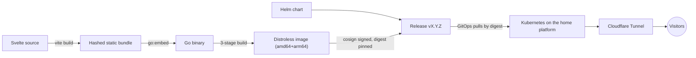

# naranjo.online

[](https://github.com/snaraj/naranjo.online/actions/workflows/pr-gate.yml)
[](https://github.com/snaraj/naranjo.online/actions/workflows/codeql.yml)
[](https://github.com/snaraj/naranjo.online/releases)
[](https://github.com/snaraj/naranjo.online/actions/workflows/pr-gate.yml)
[](https://github.com/snaraj/naranjo.online/actions/workflows/pr-gate.yml)
[](go.mod)
[](LICENSE)

Samuel's personal corner of the internet — portfolio, professional home, and
whatever deserves a permanent URL. A Svelte frontend embedded into a single
dependency-free Go binary, shipped as a distroless multi-arch container and a
Helm chart, deployed by digest onto a self-hosted Kubernetes platform behind
Cloudflare.

## How it works



The Go service serves the embedded bundle with strict caching, conditional
requests, security headers, and `/livez` + `/readyz` probes on port 8080.
There is no runtime dependency beyond the Go standard library.

## Development

```sh
# Frontend: build first — the Go embed test expects the bundle to exist.
cd frontend
npm ci --ignore-scripts
npm run check && npm test && npm run build

# Backend — the same gate CI enforces
cd ..
test -z "$(gofmt -l .)"
go vet ./...
CGO_ENABLED=0 go test ./...
go test -race ./...

# Container (both production architectures)
docker build .
```

Toolchain pins live in CI (`node 24.19.0`, `npm 11.17.0`, `go 1.26.5`);
newer local versions generally work, CI is authoritative.

## Releases

One tag does everything: pushing `vX.Y.Z` (matching `VERSION` and the chart
version — CI enforces the three-way lock) builds and publishes:

- `ghcr.io/snaraj/naranjo-online:vX.Y.Z` — multi-arch image, keyless-signed
  (Cosign), with SBOM and SLSA provenance; deployment consumes the digest,
  never the tag.
- `ghcr.io/snaraj/charts/naranjo-online` — the Helm chart as an OCI
  artifact, same version, also signed.
- A GitHub Release with the immutable digests and human notes.

Version tags are immutable: the publisher refuses to reuse one, on purpose,
with no override. See [CHANGELOG.md](CHANGELOG.md) for history and
[SECURITY.md](SECURITY.md) for the security posture.

## Media

Small UI assets live under `frontend/src/assets/` in documented categories
with a per-file size ceiling. Heavy media (source video, FLAC, delivery
derivatives) never enters this repository, the bundle, the image, or the
cluster control plane — it is served from dedicated storage on the platform.

## License

Code is [MIT](LICENSE). Site content — text, images, video, audio, branding
— is **all rights reserved**; the license does not extend to it.
